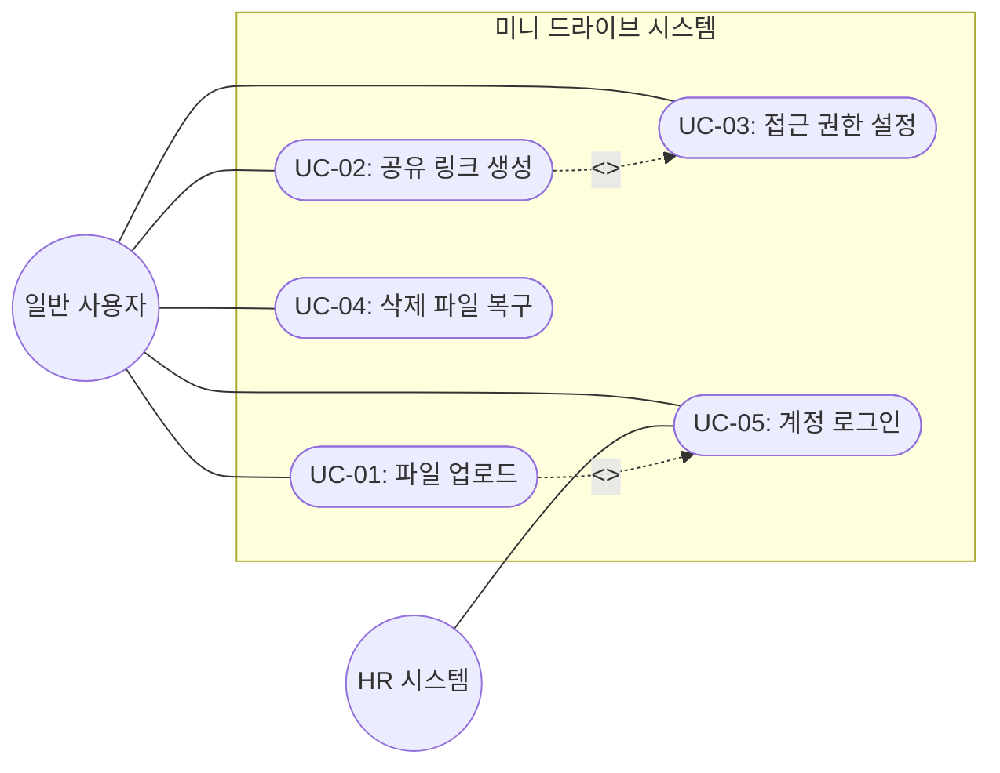
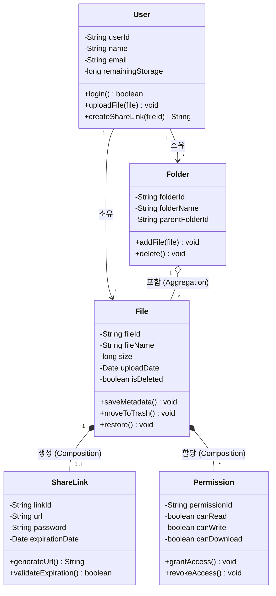
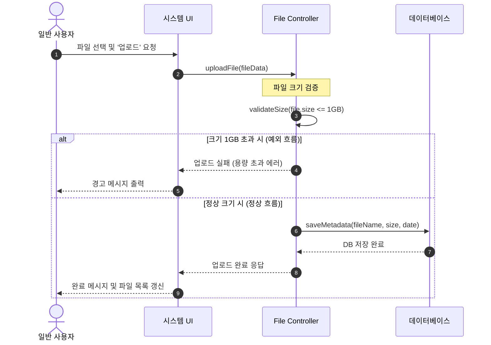

# 프로젝트 - 요구사항 분석서 (객체지향 분석)

## 1. 개요
본 문서는 '클라우드 파일 공유 시스템 (미니 드라이브)'의 요구사항 정의서를 바탕으로, 객체지향 분석 기법을 적용하여 시스템의 동작과 구조를 분석한 문서이다. 기능 관점(유스케이스), 구조 관점(도메인 모델), 행위 관점(순차 모델)의 다이어그램을 포함하여 스테이크홀더 간의 명확한 이해를 돕는다.

---

## 2. 유스케이스 모델링 (기능 관점)

### 2.1 액터(Actor) 식별
시스템과 상호작용하는 외부 엔티티를 식별한다.
* **일반 사용자 (User):** 시스템에 가입하여 파일을 업로드/다운로드하고, 타인과 공유하며 권한을 설정하는 주체
* **인사 관리 시스템 (HR System):** 직원의 계정 정보를 동기화하기 위해 연동되는 사내 외부 시스템

### 2.2 유스케이스(Use Case) 식별 및 다이어그램
요구사항 정의서를 바탕으로 사용자가 시스템을 통해 수행하는 핵심 기능들을 식별하고 시각화한다.

---

## 3. 유스케이스 명세서 (Use Case Specification)
식별된 핵심 유스케이스의 정상 흐름과 예외 흐름을 상세하게 기술한다.

### [UC-01] 파일 업로드
* **액터:** 일반 사용자
* **사전 조건:** 사용자는 시스템에 로그인되어 있어야 하며, 본인의 저장소 공간이 남아있어야 한다.
* **정상 흐름 (Main Flow):**
  1. 사용자가 업로드할 폴더 위치로 이동하여 '파일 업로드' 버튼을 클릭한다.
  2. 시스템은 파일 선택 창을 제공한다.
  3. 사용자가 업로드할 파일을 선택하여 확인을 누른다.
  4. 시스템은 파일의 크기가 제한(1GB) 이하인지 확인한다.
  5. 시스템은 파일을 서버에 저장하고, 파일명/크기/업로드 날짜 등의 메타데이터를 데이터베이스에 기록한다.
  6. 시스템은 화면에 '업로드 완료' 메시지를 표시하고 파일 목록을 갱신한다.
* **예외 흐름 (Exception Flow):**
  * 4-a. 파일 크기가 1GB를 초과할 경우: 시스템은 "최대 1GB 이하의 파일만 업로드할 수 있습니다."라는 경고 메시지를 출력하고 업로드를 취소한다.

### [UC-02] 파일 공유 링크 생성 및 권한 설정
* **액터:** 일반 사용자
* **사전 조건:** 사용자는 파일에 대한 소유권 또는 공유 권한을 가지고 있어야 한다.
* **정상 흐름 (Main Flow):**
  1. 사용자가 특정 파일을 선택하고 '공유하기' 버튼을 클릭한다.
  2. 시스템은 공유 설정(비밀번호, 만료일, 권한 등) 팝업을 제공한다.
  3. 사용자가 다운로드 허용 여부, 비밀번호, 만료일(최대 7일)을 입력하고 '링크 생성'을 요청한다.
  4. 시스템은 입력된 조건을 적용하여 고유한 URL을 생성한다.
  5. 시스템은 생성된 URL을 사용자 화면에 출력한다.
* **예외 흐름 (Exception Flow):**
  * 3-a. 만료일을 7일 초과로 설정한 경우: 시스템은 "만료일은 최대 7일까지만 설정 가능합니다."라는 메시지를 출력하고 재입력을 요구한다.

---

## 4. 도메인 모델 (구조 관점)
요구사항 명세에 등장하는 주요 개념을 추출하여 시스템의 핵심 객체와 속성, 메서드 및 관계를 정의한다.

### 4.1 클래스 다이어그램
핵심 클래스 간의 관계(소유, 복합 등)와 세부 속성/메서드를 시각화한다.

---

## 5. 동적 모델링 (행위 관점)
객체 간의 상호작용과 시간의 흐름에 따른 메시지 전달 과정을 정의한다.

### 5.1 순차 다이어그램: 파일 업로드
[UC-01] 파일 업로드 유스케이스의 정상 및 예외 흐름을 시각화한다.

