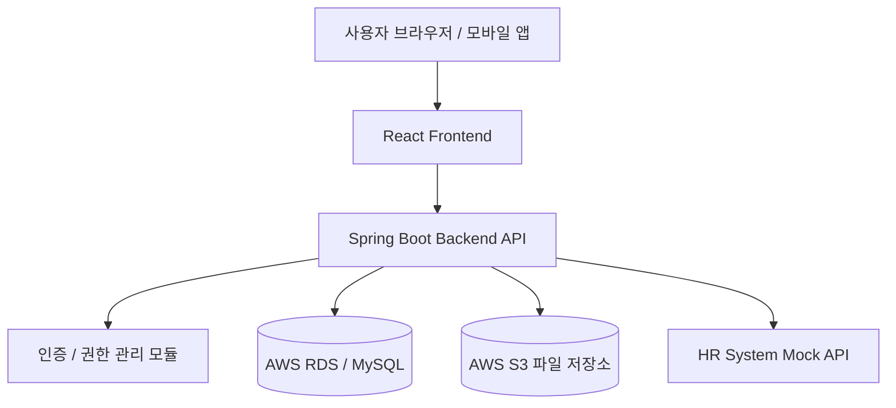

# 테스트 결과 보고서

**프로젝트명:** 클라우드 파일 공유 시스템 (미니 드라이브)  
**문서명:** 테스트 결과 보고서  
**작성자:** 김동현  
**저장 위치:** `doc/Test_Report.md`  
**작성일:** 2026-06-15  

---

## 제/개정 이력

| 버전 | 날짜 | 작성자 | 제/개정 사항 | 비고 |
|---|---|---|---|---|
| v1.0 | 2026-06-15 | 김동현 | 테스트 결과 보고서 최초 작성 | 제정 |

---

## 목차

1. 서론  
   1.1 문서 목적 및 범위  
   1.2 프로젝트 개요  
   1.3 용어 정의  
   1.4 참조 문서  

2. 테스트 개요  
   2.1 테스트 범위  
   2.2 테스트 항목 및 통과 기준  

3. 테스트 케이스  
   3.1 테스트 케이스 선정 기준  
   3.2 테스트 케이스 유형  
   3.3 테스트 케이스 목록  

4. 테스트 예외사항  
   4.1 중단 기준과 재개 조건  

5. 테스트 환경  
   5.1 테스트 환경 구성도  
   5.2 테스트 환경 상세  

6. 테스트 결과  

7. 부록  

---

# 1. 서론

## 1.1 문서 목적 및 범위

본 문서는 소프트웨어공학 과제에서 수행한 **클라우드 파일 공유 시스템(미니 드라이브)** 프로젝트의 테스트 계획과 테스트 결과를 정리하기 위해 작성되었다.

본 테스트 결과 보고서는 시스템 구현이 완료되지 않은 상황을 고려하여, 실제 실행 결과뿐만 아니라 **테스트 디자인**을 중심으로 작성한다. 따라서 각 테스트 케이스는 요구사항 정의서와 요구사항 분석서를 기반으로 설계하였으며, 실제 구현 후 동일한 테스트 케이스를 기준으로 결과를 갱신할 수 있도록 구성하였다.

본 문서의 범위는 다음과 같다.

- 기능 요구사항에 대한 테스트 케이스 설계
- 비기능 요구사항에 대한 테스트 케이스 설계
- 테스트 항목별 통과 기준 정의
- 테스트 환경 정의
- 현재 단계 기준 테스트 결과 정리

---

## 1.2 프로젝트 개요

클라우드 파일 공유 시스템(미니 드라이브)은 조직 내 파일을 중앙에서 관리하고, 사용자가 파일을 업로드/다운로드하며, 다른 사용자 또는 외부 사용자와 안전하게 파일을 공유할 수 있도록 지원하는 시스템이다.

주요 기능은 다음과 같다.

- 파일 업로드 및 다운로드
- 폴더 기반 파일 관리
- 공유 링크 생성
- 사용자별 접근 권한 설정
- 삭제 파일 복구
- 파일 검색
- 로그인 및 인증
- 데이터 암호화
- 모바일 및 웹 환경 지원
- 사내 HR 시스템과의 계정 연동

---

## 1.3 용어 정의

| 용어 | 설명 |
|---|---|
| 미니 드라이브 | 본 프로젝트에서 개발하는 클라우드 파일 공유 시스템 |
| 사용자 | 시스템에 로그인하여 파일을 업로드, 다운로드, 공유하는 일반 사용자 |
| 공유 링크 | 외부 사용자 또는 내부 사용자에게 파일 접근을 제공하기 위해 생성되는 URL |
| 권한 | 파일에 대해 읽기, 다운로드, 댓글 작성, 수정 가능 여부를 제어하는 설정 |
| 휴지통 | 삭제된 파일을 일정 기간 보관하여 복구할 수 있도록 하는 저장 공간 |
| HR 시스템 | 사내 인사 관리 시스템으로, 직원 계정 정보를 동기화하는 외부 시스템 |
| 테스트 케이스 | 특정 요구사항이 정상적으로 동작하는지 확인하기 위한 입력, 조건, 예상 결과의 집합 |

---

## 1.4 참조 문서

| 문서명 | 파일 위치 |
|---|---|
| 시스템 요구사항 정의서 | `doc/System_Requirements.md` |
| 시스템 품질 요소 추정서 | `doc/System_Quality_Attributes.md` |
| 프로젝트 관리 계획서 | `doc/Project_Management_Plan.md` |
| 요구사항 정의서 | `doc/Requirements_Definition_Document.md` |
| 요구사항 분석서 | `doc/Requirements_Analysi.md` |
| 참고 테스트 결과 보고서 | `[참고] 테스트결과 보고서` |

---

# 2. 테스트 개요

## 2.1 테스트 범위

본 테스트는 시스템 내부 구현 코드를 직접 확인하지 않는다는 가정하에 **블랙박스 테스트** 관점으로 설계한다.  
즉, 사용자의 입력과 시스템의 출력 결과를 기준으로 요구사항 충족 여부를 판단한다.

테스트 범위는 다음과 같다.

| 범위 | 내용 |
|---|---|
| 파일 관리 | 파일 업로드, 다운로드, 메타데이터 저장 확인 |
| 파일 공유 | 공유 링크 생성, 비밀번호, 만료 기간 설정 확인 |
| 권한 관리 | 사용자별 읽기, 다운로드, 댓글, 수정 권한 적용 확인 |
| 복구 관리 | 삭제 파일 휴지통 보관 및 복구 기능 확인 |
| 검색 기능 | 파일명, 날짜, 사용자, 파일 유형 기준 검색 확인 |
| 인증 및 보안 | 로그인, 비인가 접근 차단, 데이터 암호화 확인 |
| 외부 시스템 연동 | HR 시스템 계정 동기화 확인 |
| UI 및 플랫폼 | 웹 브라우저, 모바일 앱 환경에서 기능 동작 확인 |
| 성능 | 검색 응답 시간, 다운로드 시작 시간 확인 |

---

## 2.2 테스트 항목 및 통과 기준

### 2.2.1 기능별 테스트 항목

| 테스트 항목 | 통과 기준 |
|---|---|
| 파일 업로드 | 1GB 이하 파일 업로드에 성공하고 파일명, 크기, 업로드 날짜가 저장된다. |
| 파일 업로드 제한 | 1GB 초과 파일 업로드 시 오류 메시지를 출력하고 업로드를 중단한다. |
| 파일 다운로드 | 사용자는 업로드된 파일을 정상적으로 다운로드할 수 있다. |
| 공유 링크 생성 | 비밀번호와 만료 기간이 설정된 고유 URL이 생성된다. |
| 공유 링크 만료 | 만료 기간이 지난 공유 링크로 접근할 수 없다. |
| 권한 관리 | 사용자별 권한에 따라 읽기, 다운로드, 댓글, 수정 가능 여부가 다르게 적용된다. |
| 삭제 파일 복구 | 삭제된 파일은 휴지통에 보관되고 30일 이내 복구할 수 있다. |
| 검색 기능 | 파일명, 업로드 날짜, 업로드 사용자, 파일 유형 기준으로 검색할 수 있다. |
| 로그인 기능 | 올바른 이메일과 비밀번호를 입력한 경우에만 로그인할 수 있다. |
| HR 연동 | HR 시스템의 직원 계정 정보가 시스템 계정 정보와 동기화된다. |

### 2.2.2 비기능별 테스트 항목

| 테스트 항목 | 통과 기준 |
|---|---|
| 성능 테스트 | 검색 요청의 95% 이상이 1초 이내 응답한다. |
| 다운로드 성능 | 대용량 다운로드 요청 후 3초 이내 다운로드가 시작된다. |
| 보안 테스트 | 로그인하지 않은 사용자는 파일 목록 및 공유 관리 기능에 접근할 수 없다. |
| 데이터 암호화 | 서버 저장 데이터가 암호화되어 저장된다. |
| 모바일 호환성 | Android 및 iOS 앱 환경에서 주요 기능이 정상 동작한다. |
| 웹 UI 테스트 | 웹 브라우저에서 드래그 앤 드롭 파일 업로드 UI가 정상 동작한다. |
| 가용성 테스트 | 서버 부하 증가 시 오토 스케일링을 통해 서비스 중단 없이 동작한다. |

---

# 3. 테스트 케이스

## 3.1 테스트 케이스 선정 기준

테스트 케이스는 요구사항 정의서에 작성된 기능적 요구사항, 비기능적 요구사항, 인터페이스 요구사항을 기준으로 선정하였다.

특히 다음 기준을 중심으로 테스트 케이스를 설계하였다.

- 사용자가 자주 사용하는 핵심 기능인가?
- 보안 또는 데이터 손실 위험과 관련된 기능인가?
- 요구사항에서 우선순위가 높은 기능인가?
- 실패 시 시스템 신뢰도에 큰 영향을 주는 기능인가?
- 실제 구현 전에도 입력값, 예상 결과, 통과 기준을 명확히 정의할 수 있는가?

---

## 3.2 테스트 케이스 유형

| 유형 | 설명 |
|---|---|
| 기능 테스트 | 파일 업로드, 다운로드, 공유, 검색 등 기능 요구사항 확인 |
| 예외 테스트 | 잘못된 입력, 권한 없는 접근, 용량 초과 등 예외 상황 확인 |
| 보안 테스트 | 로그인 여부, 권한 제어, 암호화 여부 확인 |
| 성능 테스트 | 검색 응답 시간, 다운로드 시작 시간 확인 |
| 호환성 테스트 | 웹 브라우저, 모바일 앱 환경에서 동작 확인 |
| 연동 테스트 | HR 시스템과의 계정 동기화 확인 |

---

## 3.3 테스트 케이스 목록

### 3.3.1 파일 업로드 테스트 케이스

| Case ID | 테스트 내용 | 입력값 / 조건 | 예상 결과 | 실제 결과 | 상태 |
|---|---|---|---|---|---|
| TC-FILE-001 | 정상 파일 업로드 | 100MB PDF 파일 업로드 | 업로드 성공, 파일명/크기/날짜 저장 | 미수행 | 설계 완료 |
| TC-FILE-002 | 대용량 파일 업로드 | 1GB 이하 파일 업로드 | 업로드 성공 | 미수행 | 설계 완료 |
| TC-FILE-003 | 용량 초과 파일 업로드 | 1GB 초과 파일 업로드 | 오류 메시지 출력 후 업로드 중단 | 미수행 | 설계 완료 |
| TC-FILE-004 | 파일 다운로드 | 업로드된 파일 다운로드 요청 | 원본 파일과 동일한 파일 다운로드 | 미수행 | 설계 완료 |
| TC-FILE-005 | 파일 메타데이터 확인 | 파일 업로드 후 목록 확인 | 파일명, 크기, 업로드 날짜 표시 | 미수행 | 설계 완료 |

---

### 3.3.2 파일 공유 테스트 케이스

| Case ID | 테스트 내용 | 입력값 / 조건 | 예상 결과 | 실제 결과 | 상태 |
|---|---|---|---|---|---|
| TC-SHARE-001 | 공유 링크 생성 | 파일 선택 후 공유 링크 생성 요청 | 고유 URL 생성 | 미수행 | 설계 완료 |
| TC-SHARE-002 | 비밀번호 설정 공유 | 공유 링크에 비밀번호 설정 | 비밀번호 입력 후 접근 가능 | 미수행 | 설계 완료 |
| TC-SHARE-003 | 비밀번호 오류 | 잘못된 비밀번호 입력 | 접근 거부 메시지 출력 | 미수행 | 설계 완료 |
| TC-SHARE-004 | 만료 기간 7일 설정 | 만료 기간을 7일로 설정 | 공유 링크 생성 성공 | 미수행 | 설계 완료 |
| TC-SHARE-005 | 만료 기간 초과 설정 | 만료 기간을 10일로 설정 | 최대 7일 제한 오류 출력 | 미수행 | 설계 완료 |
| TC-SHARE-006 | 만료된 링크 접근 | 만료 기간이 지난 링크 접속 | 접근 불가 메시지 출력 | 미수행 | 설계 완료 |

---

### 3.3.3 권한 관리 테스트 케이스

| Case ID | 테스트 내용 | 입력값 / 조건 | 예상 결과 | 실제 결과 | 상태 |
|---|---|---|---|---|---|
| TC-PERM-001 | 읽기 권한 확인 | 읽기 권한만 부여된 사용자 접근 | 파일 내용 조회 가능, 수정 불가 | 미수행 | 설계 완료 |
| TC-PERM-002 | 다운로드 권한 확인 | 다운로드 권한 없는 사용자 접근 | 다운로드 버튼 비활성화 또는 거부 | 미수행 | 설계 완료 |
| TC-PERM-003 | 댓글 권한 확인 | 댓글 권한 부여 사용자 접근 | 댓글 작성 가능 | 미수행 | 설계 완료 |
| TC-PERM-004 | 수정 권한 확인 | 수정 권한 부여 사용자 접근 | 파일 수정 가능 | 미수행 | 설계 완료 |
| TC-PERM-005 | 권한 없는 사용자 접근 | 공유 대상이 아닌 사용자 접근 | 접근 거부 메시지 출력 | 미수행 | 설계 완료 |

---

### 3.3.4 삭제 및 복구 테스트 케이스

| Case ID | 테스트 내용 | 입력값 / 조건 | 예상 결과 | 실제 결과 | 상태 |
|---|---|---|---|---|---|
| TC-REC-001 | 파일 삭제 | 사용자가 파일 삭제 요청 | 파일이 휴지통으로 이동 | 미수행 | 설계 완료 |
| TC-REC-002 | 삭제 파일 복구 | 30일 이내 삭제 파일 복구 요청 | 원래 위치 또는 지정 위치로 복구 | 미수행 | 설계 완료 |
| TC-REC-003 | 보관 기간 초과 파일 확인 | 삭제 후 30일 초과 | 복구 불가 처리 | 미수행 | 설계 완료 |
| TC-REC-004 | 휴지통 목록 확인 | 휴지통 메뉴 접근 | 삭제된 파일 목록 표시 | 미수행 | 설계 완료 |

---

### 3.3.5 검색 기능 테스트 케이스

| Case ID | 테스트 내용 | 입력값 / 조건 | 예상 결과 | 실제 결과 | 상태 |
|---|---|---|---|---|---|
| TC-SEARCH-001 | 파일명 검색 | `report.pdf` 검색 | 파일명과 일치하는 결과 표시 | 미수행 | 설계 완료 |
| TC-SEARCH-002 | 날짜 조건 검색 | 특정 날짜 이후 업로드 파일 검색 | 조건에 맞는 파일만 표시 | 미수행 | 설계 완료 |
| TC-SEARCH-003 | 사용자 기준 검색 | 특정 사용자가 업로드한 파일 검색 | 해당 사용자 파일만 표시 | 미수행 | 설계 완료 |
| TC-SEARCH-004 | 파일 유형 검색 | PDF 유형 검색 | PDF 파일만 표시 | 미수행 | 설계 완료 |
| TC-SEARCH-005 | 검색 결과 없음 | 존재하지 않는 파일명 검색 | 검색 결과 없음 메시지 출력 | 미수행 | 설계 완료 |

---

### 3.3.6 로그인 및 보안 테스트 케이스

| Case ID | 테스트 내용 | 입력값 / 조건 | 예상 결과 | 실제 결과 | 상태 |
|---|---|---|---|---|---|
| TC-AUTH-001 | 정상 로그인 | 올바른 이메일/비밀번호 입력 | 로그인 성공 | 미수행 | 설계 완료 |
| TC-AUTH-002 | 비밀번호 오류 | 올바른 이메일, 잘못된 비밀번호 입력 | 로그인 실패 | 미수행 | 설계 완료 |
| TC-AUTH-003 | 이메일 형식 오류 | 이메일 형식이 아닌 값 입력 | 입력 오류 메시지 출력 | 미수행 | 설계 완료 |
| TC-AUTH-004 | 비로그인 접근 | 로그인 없이 파일 목록 URL 접근 | 로그인 화면으로 이동 또는 접근 거부 | 미수행 | 설계 완료 |
| TC-AUTH-005 | 저장 데이터 암호화 | 서버 저장 파일 확인 | 암호화된 형태로 저장 | 미수행 | 설계 완료 |

---

### 3.3.7 성능 테스트 케이스

| Case ID | 테스트 내용 | 입력값 / 조건 | 예상 결과 | 실제 결과 | 상태 |
|---|---|---|---|---|---|
| TC-PERF-001 | 검색 응답 시간 | 50명 동시 접속 검색 요청 | 95% 이상 1초 이내 응답 | 미수행 | 설계 완료 |
| TC-PERF-002 | 다운로드 시작 시간 | 대용량 파일 다운로드 요청 | 3초 이내 다운로드 시작 | 미수행 | 설계 완료 |
| TC-PERF-003 | 동시 접속 처리 | 50명 동시 로그인 및 파일 목록 조회 | 서비스 오류 없이 응답 | 미수행 | 설계 완료 |
| TC-PERF-004 | 오토 스케일링 확인 | 부하 증가 상황 발생 | 서버 확장 후 서비스 유지 | 미수행 | 설계 완료 |

---

### 3.3.8 UI 및 호환성 테스트 케이스

| Case ID | 테스트 내용 | 입력값 / 조건 | 예상 결과 | 실제 결과 | 상태 |
|---|---|---|---|---|---|
| TC-UI-001 | 웹 업로드 버튼 확인 | 업로드 버튼 클릭 | 파일 선택 창 표시 | 미수행 | 설계 완료 |
| TC-UI-002 | 드래그 앤 드롭 업로드 | 파일을 브라우저에 드래그 | 업로드 영역에 파일 추가 | 미수행 | 설계 완료 |
| TC-UI-003 | Chrome 브라우저 테스트 | Chrome에서 주요 기능 수행 | 정상 동작 | 미수행 | 설계 완료 |
| TC-UI-004 | Edge 브라우저 테스트 | Edge에서 주요 기능 수행 | 정상 동작 | 미수행 | 설계 완료 |
| TC-UI-005 | Android 앱 테스트 | Android 앱에서 업로드/다운로드 | 정상 동작 | 미수행 | 설계 완료 |
| TC-UI-006 | iOS 앱 테스트 | iOS 앱에서 업로드/다운로드 | 정상 동작 | 미수행 | 설계 완료 |

---

### 3.3.9 외부 시스템 연동 테스트 케이스

| Case ID | 테스트 내용 | 입력값 / 조건 | 예상 결과 | 실제 결과 | 상태 |
|---|---|---|---|---|---|
| TC-INT-001 | HR 계정 동기화 | HR 시스템에 신규 직원 등록 | 미니 드라이브 계정 자동 생성 | 미수행 | 설계 완료 |
| TC-INT-002 | HR 계정 삭제 연동 | HR 시스템에서 직원 퇴사 처리 | 미니 드라이브 계정 비활성화 | 미수행 | 설계 완료 |
| TC-INT-003 | HR 정보 변경 연동 | HR 시스템에서 부서 정보 변경 | 사용자 그룹 또는 권한 정보 갱신 | 미수행 | 설계 완료 |

---

# 4. 테스트 예외사항

## 4.1 중단 기준과 재개 조건

| 중단 기준 | 재개 조건 |
|---|---|
| 테스트 서버 또는 DB 서버가 실행되지 않는 경우 | 서버 및 DB 연결 복구 후 테스트 재개 |
| 로그인 기능이 동작하지 않아 다른 기능 테스트가 불가능한 경우 | 인증 기능 수정 후 파일 관리 테스트 재개 |
| 파일 업로드 기능이 전혀 동작하지 않는 경우 | 업로드 API 또는 저장소 연결 복구 후 관련 테스트 재개 |
| 테스트 데이터가 손상되거나 삭제된 경우 | 백업 테스트 데이터 복원 후 재개 |
| 성능 테스트 중 서버가 중단되는 경우 | 서버 상태 확인 및 부하 조건 조정 후 재개 |
| 외부 HR 시스템 Mock API가 응답하지 않는 경우 | Mock 서버 재실행 후 연동 테스트 재개 |

---

# 5. 테스트 환경

## 5.1 테스트 환경 구성도

---

## 5.2 테스트 환경 상세

| 구분 | 내용 |
|---|---|
| 테스트 방식 | 블랙박스 테스트 |
| 테스트 대상 | 클라우드 파일 공유 시스템 |
| 프론트엔드 | React.js |
| 백엔드 | Java 17, Spring Boot |
| 인증 | Spring Security, JWT |
| 데이터베이스 | AWS RDS 또는 MySQL |
| 파일 저장소 | AWS S3 또는 로컬 Mock 저장소 |
| 브라우저 | Chrome, Edge |
| 모바일 환경 | Android, iOS |
| 외부 연동 | HR System Mock API |
| 성능 테스트 도구 | JMeter 또는 k6 사용 예정 |
| 형상 관리 | GitHub |

---

# 6. 테스트 결과

본 프로젝트는 현재 실제 구현이 완료되지 않은 상태이므로, 테스트 결과는 실제 수행 결과가 아니라 **테스트 디자인 기준의 수행 예정 상태**로 정리한다.  
향후 시스템 구현이 완료되면 본 테스트 케이스를 기준으로 실제 결과를 `PASS`, `FAIL`, `PARTIAL SUCCESS`로 갱신한다.

## 6.1 테스트 결과 요약

| 구분 | 테스트 케이스 수 | 수행 결과 | 비고 |
|---|---:|---|---|
| 파일 업로드/다운로드 | 5 | 미수행 | 테스트 설계 완료 |
| 파일 공유 | 6 | 미수행 | 테스트 설계 완료 |
| 권한 관리 | 5 | 미수행 | 테스트 설계 완료 |
| 삭제 및 복구 | 4 | 미수행 | 테스트 설계 완료 |
| 검색 기능 | 5 | 미수행 | 테스트 설계 완료 |
| 로그인 및 보안 | 5 | 미수행 | 테스트 설계 완료 |
| 성능 테스트 | 4 | 미수행 | 테스트 설계 완료 |
| UI 및 호환성 | 6 | 미수행 | 테스트 설계 완료 |
| 외부 시스템 연동 | 3 | 미수행 | 테스트 설계 완료 |
| **합계** | **43** | **미수행** | **테스트 디자인 완료** |

---

## 6.2 기능 테스트 결과

| Case ID | 테스트 항목 | 예상 결과 | 실제 결과 | 판정 |
|---|---|---|---|---|
| TC-FILE-001 ~ TC-FILE-005 | 파일 업로드/다운로드 | 파일 저장, 다운로드, 메타데이터 저장 정상 처리 | 미수행 | 설계 완료 |
| TC-SHARE-001 ~ TC-SHARE-006 | 공유 링크 | 비밀번호, 만료 기간, 접근 제한 정상 처리 | 미수행 | 설계 완료 |
| TC-PERM-001 ~ TC-PERM-005 | 권한 관리 | 권한별 기능 접근 제어 정상 처리 | 미수행 | 설계 완료 |
| TC-REC-001 ~ TC-REC-004 | 삭제 및 복구 | 삭제 파일 보관 및 복구 정상 처리 | 미수행 | 설계 완료 |
| TC-SEARCH-001 ~ TC-SEARCH-005 | 검색 | 조건별 검색 결과 정상 표시 | 미수행 | 설계 완료 |

---

## 6.3 비기능 테스트 결과

| Case ID | 테스트 항목 | 예상 결과 | 실제 결과 | 판정 |
|---|---|---|---|---|
| TC-AUTH-001 ~ TC-AUTH-005 | 인증 및 보안 | 로그인, 접근 제어, 암호화 정상 처리 | 미수행 | 설계 완료 |
| TC-PERF-001 ~ TC-PERF-004 | 성능 및 가용성 | 검색 1초 이내, 다운로드 3초 이내 시작, 오토 스케일링 정상 동작 | 미수행 | 설계 완료 |
| TC-UI-001 ~ TC-UI-006 | UI 및 호환성 | 웹/모바일 환경에서 주요 기능 정상 동작 | 미수행 | 설계 완료 |
| TC-INT-001 ~ TC-INT-003 | HR 시스템 연동 | 계정 생성, 삭제, 정보 변경 연동 정상 처리 | 미수행 | 설계 완료 |

---

## 6.4 결함 및 개선 필요 사항

현재 단계에서는 실제 구현 및 테스트 실행이 완료되지 않았으므로, 발견된 결함은 없다.  
다만 테스트 설계 관점에서 다음 사항은 구현 후 반드시 확인해야 한다.

| 개선 필요 사항 | 설명 |
|---|---|
| 대용량 파일 테스트 데이터 준비 | 1GB 이하/초과 파일을 모두 준비해야 한다. |
| 권한 조합 테스트 확대 | 읽기, 다운로드, 댓글, 수정 권한 조합에 따른 테스트가 필요하다. |
| 공유 링크 보안 검증 | 링크 추측 가능성, 만료 처리, 비밀번호 검증 로직 확인이 필요하다. |
| 성능 테스트 자동화 | 검색 및 다운로드 성능 테스트를 JMeter 또는 k6로 자동화해야 한다. |
| HR 연동 Mock 구성 | 실제 HR 시스템 대신 Mock API를 구성하여 연동 테스트를 수행해야 한다. |
| 모바일 테스트 환경 확보 | Android/iOS 테스트 기기를 확보하거나 에뮬레이터를 사용해야 한다. |

---

# 7. 부록

## 7.1 테스트 결과 판정 기준

| 판정 | 의미 |
|---|---|
| PASS | 예상 결과와 실제 결과가 일치함 |
| FAIL | 예상 결과와 실제 결과가 일치하지 않음 |
| PARTIAL SUCCESS | 일부 조건에서는 성공했으나 일부 조건에서 실패함 |
| 미수행 | 실제 구현 또는 테스트 환경이 준비되지 않아 아직 수행하지 않음 |
| 설계 완료 | 테스트 케이스와 통과 기준은 정의되었으나 실행 전 상태 |

---

## 7.2 향후 테스트 수행 계획

1. 핵심 기능 구현 후 파일 업로드/다운로드 테스트를 우선 수행한다.
2. 로그인 및 권한 관리 기능을 검증한 뒤 공유 링크 테스트를 수행한다.
3. 검색 기능과 복구 기능을 테스트한다.
4. 전체 기능 통합 후 성능 테스트를 수행한다.
5. 모바일 앱 및 웹 브라우저 호환성 테스트를 수행한다.
6. 테스트 결과를 PASS/FAIL 기준으로 갱신한다.

---

## 7.3 작업 기여 내용

- 요구사항 정의서와 요구사항 분석서를 기반으로 테스트 범위를 도출하였다.
- 기능 요구사항과 비기능 요구사항을 구분하여 테스트 항목을 정의하였다.
- 실제 구현 전 단계에서도 활용 가능한 테스트 디자인을 작성하였다.
- 총 43개의 테스트 케이스를 기능, 보안, 성능, UI, 연동 관점으로 분류하였다.
- 향후 구현 완료 후 실제 테스트 결과를 PASS/FAIL 기준으로 갱신할 수 있도록 결과 표를 구성하였다.
